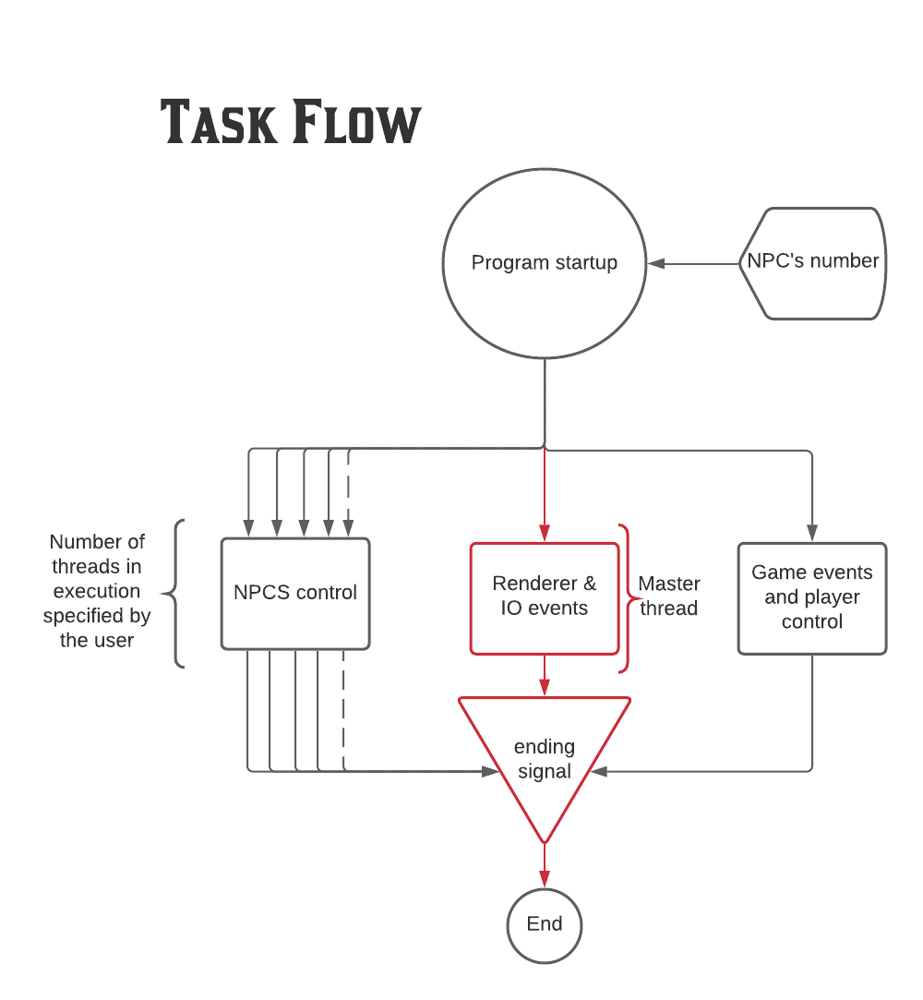
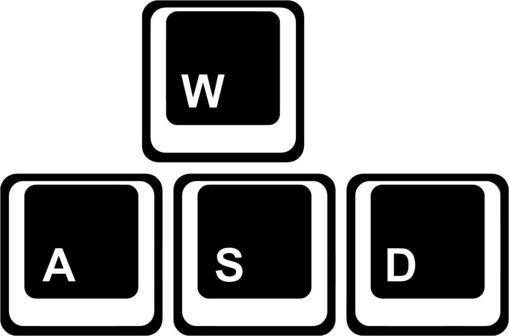

Multithreaded Pacman Game
=========================

Implement a multithreaded version of the arcade video game [Pacman](https://en.wikipedia.org/wiki/Pac-Man). This version will be a
Computer vs Human game. Each enemy will be independent and the number of enemies is configurable. Below you can see the general
requirements for the enemies and human player (pacman) interation.

Technical Requirements
----------------------
- The game's maze layout can be static.
- The `pacman` gamer must be controlled by the user.
- Enemies are autonomous entities that will move a random way.
- Enemies and pacman should respect the layout limits and walls.
- Enemies number can be configured on game's start.
- Each enemy's behaviour will be implemented as a separated thread.
- Enemies and pacman threads must use the same map or game layout data structure resource.
- Display obtained pacman's scores.
- Pacman loses when an enemy touches it.
- Pacman wins the game when it has taken all coins in the map.

Previous Requirements
=========================
- You are running macOS Catalina
- You have installed Xcode command line tools
- You have installed brew

Architecture
-------------

Multithreaded Pacman created with graphical interface and implemented in C, using the libraries SDL (SDL2 image and SDL2 ttf) and OpenMP for GUI and user input and use of threads, respectively. 

Task Flow diagram:

Usage
-------------
For the usage of the Multithreaded Pacman Videogame is the classic W,A,S,D keys from the keyboard that will control Up, Left, Down and Right, respectevely.

.

Structures
-------------

The different structures (structs) used on the Multithreaded Pacman Videogame are as follows:

### Player (with globlal variables)

| Attibutes                  |   DataType   | Description                                                                      |
|----------------------------|--------------|----------------------------------------------------------------------------------|
|     playerX                |     double   | Player´s coordinate on X from the map.                                           |
|     playerY                |     double   | Player´s coordinate on Y from the map.                                           |
|     playerDirection        |     int      | Saves the direction of the NPC(Up, Down, Left, Right)                            |

### Cell
| Attibutes                  |   DataType   | Description                                                                      |
|----------------------------|--------------|----------------------------------------------------------------------------------|
|     isPath                 |     bool     | Gives if certain cell of the map is a path or not.                               |
|     resType                |     int      | Saves the different type of cells available (Barrier, Coin, PowerUp, Path)       |
|     hasPoints              |     bool     | Gives if certain cell of the map is has a point or not(walkable by the player).  |

### NPC
| Attibutes                  |   DataType   | Description                                                                      |
|----------------------------|--------------|----------------------------------------------------------------------------------|
|     isAlive                |     bool     | Checks if the NPC is alive                                                       |
|     isEdible               |     bool     | Checks if the NPC can be eated by the player                                     |
|     direction              |     int      | Saves the direction of the NPC(Up, Down, Left, Right)                            |
|         x                  |     double   |xxxxxxxxxxxxxxxxxxxxxx                                                            |
|         y                  |     double   |xxxxxxxxxxxxxxxxxxxxxx                                                            |

Functions
-------------
`setDirectionPlayerRender(): void` Changes player´s face direction according to movement (Up, Down, Left, Right).

`keyboardHandler(const char *): void` Manages keyboard input (Player´s trigger).

`initPlayerResources(): void` Initialize player´s attributes.

`initMap(): void` Initialize map´s attributes.

`initNPCS(): void` Initialize NPC´s attributes.

`getMod(double,double): double` Get module of a set of numbers (including negative numbers). Function used for map movement regarding the player. (Entering one side and exiting the opposite side.)

`msleep(unsigned int tms): int` Function for time management regarding updates and movements.

`collectCoin(int): void` Function when the player collides with a coin, adds on counter score, decreases coins left.

`collectPowerUp(int): void` Function when the player collides with a power-up, changes NPC´s to eatable.

`movePlayer(): void` Gives the player constant movement according to the input.

`checkMapForPoints(): void` Checks the map with respect the player in terms of position.

`getIndexByXY(int, int): int`Finds coordinate within the map.

`checkCollision(): void` Check if the NPC is colliding with a wall.

`NPCController(int): void` Function that runs on each thread.

`moveNPC(int): void` Gives the NPC movement.

`randomInRange(int,int): int` Gives random number in certain range used for the NPC´s random movement.

`changeNPCDirection(int,int): void` Change´s NPC´s direction.

`isInCollision(int): bool`Checks if the NCP´s is in collision within the map.

`powerUpDriver(): void` Timer used for down timing once power up is activated.

`killPacman(): void` Kills the player. Respawn at center once killed.

`buildMap(): void` Constructs the map.

`countCoins(): int`Counts the coins on the map.

